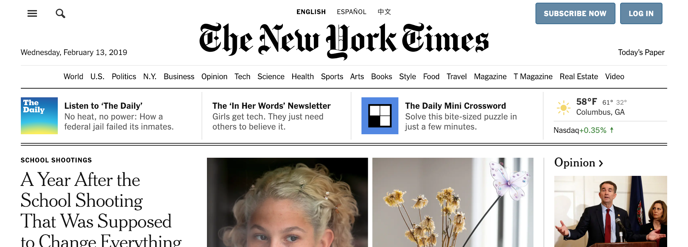
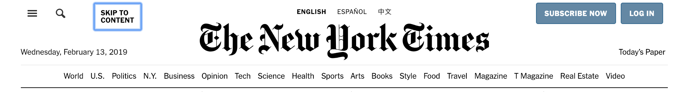
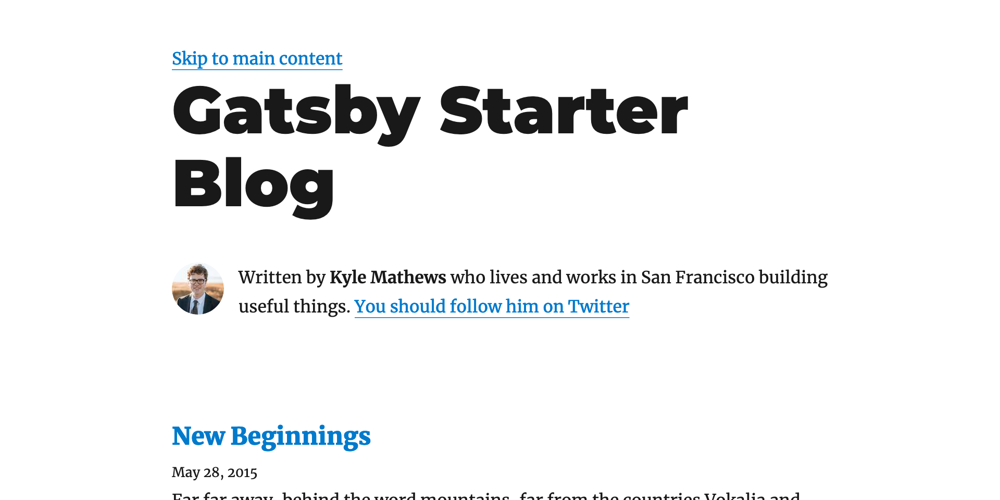
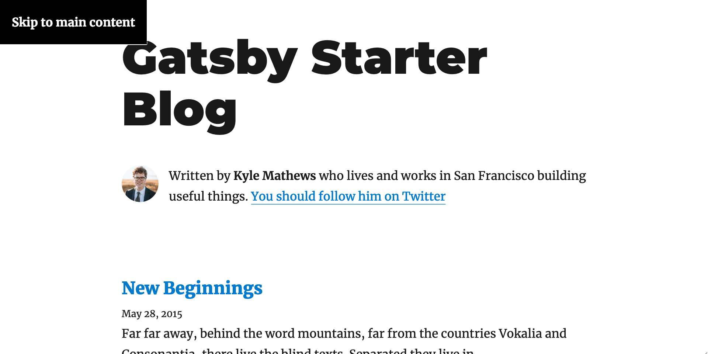

Skip links, also referred to as skip navigation links, are a tool utilized by keyboard users to quickly navigate through a web pages.

When a new page loads, the focus is placed at the top of the accessibility tree. Then, when a user presses <kbd>tab</kbd>, the focus moves to the first focusable element. For an example of this, go to [gatsbyjs.com](https://www.gatsbyjs.com/) and try tabbing:


Like the image above (captured on 13 Feb. 2019), you should see a faint blue outline around the main "Gatsby" link in the header. By continuing to press <kbd>tab</kbd>, you can move through the rest of the links in the header and select your options using <kbd>enter</kbd>.

Moving focus with tab, and interacting with elements with either enter or space are the fundamentals of keyboard navigation. This one of the most important aspects of web accessibility and should be tested in every site or application that you develop.

You may have noticed while navigating the Gatsby site that you needed to tab through each and every header link before you could move on to the rest of the content of the website. If you chose to navigate to a different page, the focus was reset and you would need to tab through all the options again.

## Sites with complex headers

If you're working on a small app or simple site, requiring your keyboard users to tab through a few header links on every page might not be a big ask. But imagine spending some time on a popular website like the [New York Times](https://nytimes.com) while navigating solely with the keyboard.



Using tab alone, it takes **36 key presses**[^1] to move the focus from the top of the page to the main headline.

After a few pages, I'm sure you'd get tired of hitting tab so many times to get to the meaningful content, and move to a website that's more user friendly.

Fortunately for everyone, the team at the New York Times anticipated that poor user experience and included skip links to jump to the main content or site index in just a few tabs. They **saved their users over 30 tabs** by including skip links!



Skip links are a relatively simple feature that can have a big improvement on your site's accessibility and user experience. Let's look at how we can add skip links to a Gatsby site.

## Linking to sections

When solving this problem, my first through was to use Gatsby's `Link` component that is used for navigating between pages. However, `Link` wasn't created to accommodate in-page links, so we're going to go with a more traditional solution: the anchor (`<a>`) tag.

We're going to use an anchor that links to a location within the same page. MDN has a useful [example of how to link sections on the same page](https://developer.mozilla.org/en-US/docs/Web/HTML/Element/a#Linking_to_another_section_on_the_same_page) if you need a refresher.

_**Note**: All the code examples will be from [Gatsby's blog starter](https://github.com/gatsbyjs/gatsby-starter-blog). However, the starters are prone to change, so please forgive me if the code below doesn't match the current version. The principles remain the same._

First, let's go to `src/components/layout.js` and add an `id` to the `main` element:

```jsx{4}
return (
  <div>
    <header>{header}</header>
    <main id="main">{children}</main>
    <footer>...</footer>
  </div>
)
```

Now we have a target to which we can navigate. We'll create a separate `SkipLink` component that simply returns a link to our `#main` target. We don't need any props, state, or lifecycle methods at the moment, so we'll go with a simple functional component:

```jsx
import React from 'react'

const SkipLink = () => {
  return <a href="#main">Skip to main content</a>
}

export default SkipLink
```

Now we can import `SkipLink` in `src/components/layout.js` and add it to the top of the return:

```jsx{3}
return (
  <div>
    <SkipLink />
    <header>{header}</header>
    <main id="main">{children}</main>
    <footer>...</footer>
  </div>
)
```

After adding that code, you should see something like this:



If you test it out, you'll see that the skip link correctly updates the url by appending `#main`, and moves the window down (provided there is enough content).

This may look like job nearly finished, but there is some crucial functionality missing from our skip link. While the window did move, if we were to hit <kbd>tab</kbd> again, you would find the focus move to the header--bringing the window with it!

That might be frustrating at first, but it makes sense. We may have clicked on an anchor, but the tab order remains the same. It's better for the browser to keep remember and preserve that tab order rather than trying to infer where to focus should go next.

So we can't rely on updating the hash alone; we need to move the focus to our `#main` element too.

## Moving focus

Let's revisit our `SkipLink` component and do some refactoring. We want to fire a function changing the focus when the url hash updates. In order to achieve that, we need to add an event listener to the window.

Event listeners should be added when components mount, or specifically during the `componentDidMount` lifecycle hook. You can [read more about `componentDidMount` in the React documentation](https://reactjs.org/docs/react-component.html#componentdidmount).

To use lifecycle methods, we need to first convert `SkipLink` from a functional to a class component. Let's do that first:

```jsx{1-2,6-7}
class SkipLink extends React.Component {
  render() {
    return <a href="#main">Skip to main content</a>
  }
}
```

_**Note**: This is one of the reasons why React Hooks are so nice. They enable your to add additional features to your functional components without refactoring. [Checkout my guide on using React Hooks here](https://seanmcp.com/articles/convert-class-component-to-function-with-hooks)._

Now, let's implement the `componentDidMount` lifecycle method and add an event listener when our component mounts. We'll also add a `className` that we will reference later in this guide.

```jsx{2-8}
class SkipLink extends React.Component {
  componentDidMount() {
    window.addEventListener('hashchange', () => {
      if (location.hash === '#main') {
        document.getElementById('main').focus()
      }
    })
  }
  render() {
    return (
      <a className="SkipLink" href="#main">
        Skip to main content
      </a>
    )
  }
}
```

Our event listener is waiting for the hash to change, then doing a quick comparison. If the new location hash is `#main`, then we'll grab the element from the DOM and call its [focus method (MDN)](https://developer.mozilla.org/en-US/docs/Web/API/HTMLElement/focus). If not, then nothing happens. This allows for other in-page links to be used without shifting focus.

### Potential error

Depending on the version of `gatsby-starter-blog` you cloned or the rest of your configuration, you may be see an error right now when you try to start the development server. If not, **skip this section**.

```
/Users/seanmcp/examples/gatsby-skip-link/src/components/SkipLink.js
  10:17  error  Unexpected use of 'location'  no-restricted-globals

✖ 1 problem (1 error, 0 warnings)
```

This error comes from ESLint error and means that you need to adjust your configurations slightly to allow access to the global `location` object.

Open up your `package.json` and add the following block of code:

```json
"eslintConfig": {
    "env": {
        "browser": true
    }
}
```

That should resolve the above error by telling ESLint that this code is going to be run in a browser environment and that objects in the Browser API are allowed.

If you want more control over Gatsby's ESLint configurations, checkout [gatsby-plugin-eslint](https://www.gatsbyjs.org/packages/gatsby-plugin-eslint/).

### Clean up

Anytime you add an event listener to a global object, you want to make sure to remove it to prevent memory leakage. We'll use `componentWillUnmount` lifecycle method to clean up that event listener.

```jsx{9-15}
class SkipLink extends React.Component {
  componentDidMount() {
    window.addEventListener('hashchange', () => {
      if (location.hash === '#main') {
        document.getElementById('main').focus()
      }
    })
  }
  componentDidMount() {
    window.addEventListener('hashchange', () => {
      if (location.hash === '#main') {
        document.getElementById('main').focus()
      }
    })
  }
  render() {
    return (
      <a className="SkipLink" href="#main">
        Skip to main content
      </a>
    )
  }
}
```

We are repeating a lot of code here, so let's create a separate method for our focusing on the `#main` element.

```jsx{3,6,8-12}
class SkipLink extends React.Component {
  componentDidMount() {
    window.addEventListener('hashchange', this.focusOnMain)
  }
  componentDidMount() {
    window.addEventListener('hashchange', this.focusOnMain)
  }
  focusOnMain = () => {
    if (location.hash === '#main') {
      document.getElementById('main').focus()
    }
  }
  render() {
    return (
      <a className="SkipLink" href="#main">
        Skip to main content
      </a>
    )
  }
}
```

That looks better! I used an arrow function for our method, which automatically binds `this`. If you prefer to use the standard function notation, make sure to add a constructor and bind your method the normal way.

Now if you test it out, you'll notice that hitting <kbd>tab</kbd> after the skip link moves the focus to the next logical link. Alright, nearly there!

## Visible on focus

Finally, we need our skip link to only be visible only when focused. To do that, we'll use [CSS's `:focus` selector (CSS-Tricks)](https://css-tricks.com/almanac/selectors/f/focus/).

_**Note**: I'm going to use vanilla CSS here, but you could just as easily use a pre-processed version or some type of CSS-in-JS. Whatever floats your boat!_

I'm going to create a `SkipLink.css` file in the same directory as my component and add the following styles:

```css
.SkipLink {
  background: black;
  color: white;
  font-weight: bold;
  padding: 1rem;
  position: absolute;
  top: 0;
  left: -9999px;
}

.SkipLink:focus {
  left: 0;
}
```

I went with bold white text on a black background to make our skip link really jump out, but feel free to follow your site's color palette. Just make sure there is sufficient color contrast between text and background (checkout [WebAIM's Color Contrast Checker](https://webaim.org/resources/contrastchecker/))!

After importing the new CSS styles into our `SkipLink` component, we're all set!

```jsx{3}
import React from 'react'

import './SkipLink.css'

class SkipLink extends React.Component { ... }
```

Now if we let the development server reload and hit tab, we're greeted by our new, style skip link:



[^1]: The New York Times implements skip links that solve this problem for their users.
