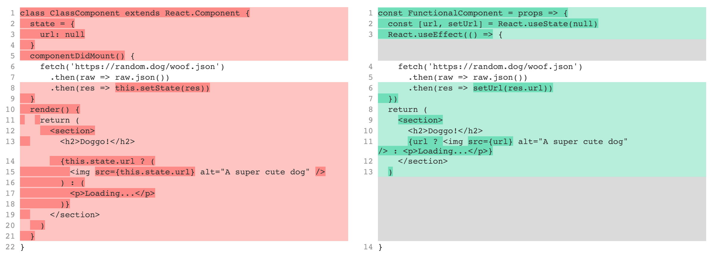

Last year, the React team announced hooks, an upcoming feature to more easily abstract logic into reusable components On the day of the announcement, [I wrote and article](https://medium.com/@seanmcp/refactoring-a-render-prop-with-hooks-fc22ed537199) explaining how to refactor a render prop component with hook. Starting this week, following the stable release of [React v16.8](https://reactjs.org/blog/2019/02/06/react-v16.8.0.html), you can now add hooks in your projects!

Today, I want to look at a typical class component and demonstrate how hooks can simplify your code by converting it into a functional component. Let's jump in.

## Terminology

I'm going to use the terms "class" and "functional" components to refer to the modern options for creating components. A class component looks something like this:

```jsx
class ClassExample extends React.Component {
  state = { greeting: 'Hello' }
  render() {
    return (
      <span>
        {this.state.greeting}, {this.props.name}!
      </span>
    )
  }
}
```

Class components have access to internal state, methods, and a `this` to reference. These components have been the powerhouses of React development throughout its history.

The aptly named functional components are functions that return JSX. Here's a typical example:

```jsx
const FunctionalExample = props => {
  const greeting = 'Howdy'
  return (
    <span>
      {greeting}, {props.name}!
    </span>
  )
}
```

Functional components lack an internal state, methods, and `this`. In order to access props, we refer to the `props` parameter.

Because they contain less internal logic, functional components are sometimes referred to as "dumb" or "presentational" components.

Although different in composition, class and functional components are used in the same manner. Imagine the return of a parent component:

```jsx
return (
  <section>
    <ClassExample name="Sean" />
    <FunctionalExample name="partner" />
  </section>
)
```

To understand how React internally understands and processes these two different types of components, I recommend Dan Abramov's ["How Does React Tell a Class from a Function?"](https://overreacted.io/how-does-react-tell-a-class-from-a-function/).

These are simplified definitions and examples, but they will provide us with a good basis for the rest of the article.

## Class component

I have a component that makes an API request on mount, stores the response in state, then renders an image based on the data. Here's the code:

```jsx
class ClassComponent extends React.Component {
  state = {
    url: null
  }
  componentDidMount() {
    fetch('https://random.dog/woof.json')
      .then(raw => raw.json())
      .then(res => this.setState(res))
  }
  render() {
    return (
      <section>
        <h2>Doggo!</h2>
        {this.state.url ? (
          
        ) : (
          <p>Loading...</p>
        )}
      </section>
    )
  }
}
```

> Note: To create this example, I looked through Todd Motto's awesome list of ["Public APIs"](https://github.com/toddmotto/public-apis). Check it out and give it a star if you find it useful.

I used the fetch library to keep the example straight forward, but I recommend using a more robust option like [Axios](https://github.com/axios/axios) for better error handling.

## Functional Component

Using React Hooks, we can create the same example from above using a functional component.

### Setup

We'll create a new file for our functional code and set up a basic function. Then copy the `return` from our class component and remove all references to `this.state`. We need to declare a variable to prevent reference errors, so let's call it `url`.

```jsx{2,4-7}
const FunctionalComponent = props => {
  const url // We'll change this later
  return (
    <section>
      <h2>Doggo!</h2>
      {url ?  : <p>Loading...</p>}
    </section>
  )
}
```

### useEffect

In our class component, we make an AJAX request when the component mounted and stored that data in state. `componentDidMount` and the other lifecycle methods were limited to classes. However, React solved that problem too with the `useEffect` hook.

`useEffect` is a method that takes two parameters: 1) a function to call on mount, and 2) variables to watch for updating. For our example, we'll only need the first of these two parameters.

We'll pass an anonymous function that calls fetch processes the data. We'll just log the response for now.

```jsx{3-7}
const FunctionalComponent = props => {
  const url
  React.useEffect(() => {
    fetch('https://random.dog/woof.json')
      .then(raw => raw.json())
      .then(res => console.log(res))
  })
  return (
    <section>
      <h2>Doggo!</h2>
      {url ?  : <p>Loading...</p>}
    </section>
  )
}
```

If you are coding along, you should see the following in the console when your component mounts:

```
{ "url": "https://random.dog/867580b3d005.jpg" }
```

This shows us that our API call is working, but logging the response isn't our goal; we need to store the data for later. Let's revisit the `url` variable that we created.

### useState

Now that we have the response from our API, we need to be able to store and reference that value. In our class component, we used its state and the `setState` method to remember that data.

React's `useState` hook gives us access to a similar API without using a class. When calling the function and optionally passing a default value, we receive two returned variables: 1) a reference to the value, and 2) a function to update that value.

Using array destructuring, we can grab those variables and assign any name that we want. For our example, we'll call the value `url` and the setter function `setUrl`.

We'll replace our old `url` with the results from `useState`:

```jsx{2}
const FunctionalComponent = props => {
  const [url, setUrl] = React.useState(null)
  React.useEffect(() => {
    fetch('https://random.dog/woof.json')
      .then(raw => raw.json())
      .then(res => console.log(res))
  })
  return (
    <section>
      <h2>Doggo!</h2>
      {url ?  : <p>Loading...</p>}
    </section>
  )
}
```

Using `useState`, we can quickly add basic state getting and setting in our functional component.

In the code above, we're just logging the response from our API. Now we want to use the `setUrl` function to set the value or url in our component's state.

```jsx{6}
const FunctionalComponent = props => {
  const [url, setUrl] = React.useState(null)
  React.useEffect(() => {
    fetch('https://random.dog/woof.json')
      .then(raw => raw.json())
      .then(res => setUrl(res.url))
  })
  return (
    <section>
      <h2>Doggo!</h2>
      {url ?  : <p>Loading...</p>}
    </section>
  )
}
```

You can checkout a [live example](https://codesandbox.io/s/wwvmq1v407) of our code on CodeSandbox.

## Comparison

Let's look at a before-and-after comparison of our two components.



Our new component is a little shorter than the original class component, and the variables are shorter and easier to reference.

While both of those things are nice, I don't find either a convincing reason to go back and convert all my class components.

More important to me is the fact that you use a functional component for nearly everything in your application. Since every component is functional, it makes the process of bringing in or removing state and lifecycle methods much easier.

## Embrace the class-less future

For these reasons, the future of React is class-less and that's a good thing. Hooks provide more flexibility when creating and managing components, to say nothing of [custom hooks](https://reactjs.org/docs/hooks-custom.html).

But don't panic and convert all your class components right now; ["they'll be supported for a looooong time"](https://twitter.com/dan_abramov/status/1026839679197437953). However, when you have the opportunity to refactor a class component going forward, consider converting it into a functional component with hooks.

I hope that helps! Let me know if you have any questions, comments, or corrections on Twitter: [@\_seanmcp](https://twitter.com/_seanmcp).

Happy coding!
